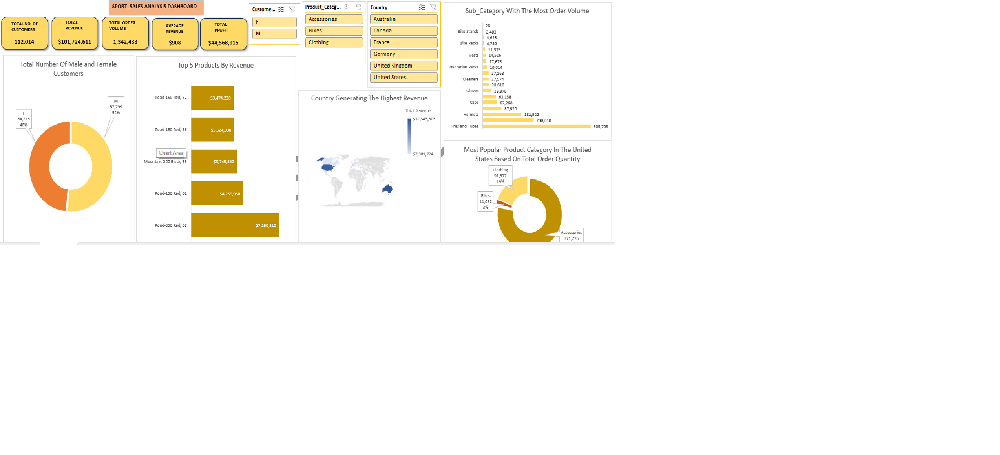

# Sport_Sales_Report
  By Tare Amuduaghan

## Project Overview

This project aims at analyzing a five years sport sales data to find insights and patterns. The analysis involves data cleaning, exploratory data analysis and visualizations.

## Problem Statement
The goal of this analysis is to analyse sport sales for a five years period in other to identify trends, give insights and data-driven recommendations that can guide business strategies. I will be using the provided dataset to answer the following business questions.

1. How many Male and Female customers do we have?
2. Which category of product is most popular in the united state?
3. What are the top 5 products by revenue?
4. What sub category has the most order volume?
5. Which country did we generate the most revenue from?

## Data Source
The primary dataset used for this analysis was gotten from [sport_sales_data](https://kaggle.com), a csv file containing detailed information.

### Tool
- Excel [Download here](https://microsoft.com)

### Skills Demonstrated
The following tasks were performed before proceeding with analysing the data to get insights;

1. Data loading and inspection
2. Handling missing values
3. Data cleaning and formatting
4. Removing duplicates

### Exploratory Data Analysis and Visualization
This project contains one report page

### Findings

### Recommendations
   
